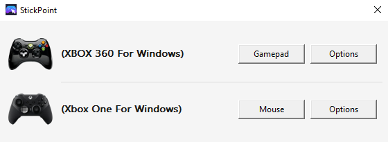

# StickPoint

Use a gamepad as a mouse on Windows 10+.

Hold the **Guide button** (Xbox logo / PS button / Home) then press **A** to toggle mouse mode. In mouse mode the left thumbstick moves the cursor and the face buttons trigger clicks. Press the same combo again to return to normal.



## Controls

### Activating mouse mode

| Input | Action |
|---|---|
| Guide + A | Toggle mouse mode on / off |
| Guide (hold 1.2 s) | Exit mouse mode |

### While in mouse mode

| Input | Action |
|---|---|
| Left stick | Move cursor |
| A | Left click |
| A → A (quick) | Double-click |
| B | Right click |
| Y | Middle click |
| Left trigger | Left click / drag (analog) |
| Right trigger | Right click / drag (analog) |
| LB | Scroll up |
| RB | Scroll down |
| Right stick Y | Fine scroll |

## Requirements

- Windows 10 or later
- Xbox controller (wired or wireless via USB/adapter)  
  Other XInput-compatible controllers (many third-party gamepads) should also work.
- `XInput1_4.dll` — ships with Windows 8+ and is present on all Windows 10+ installs

## Building

**Prerequisites:** CMake 3.20+, Visual Studio 2019+ or MinGW-w64.

```bat
git clone <repo-url>
cd strickpoint

:: Visual Studio (recommended)
cmake -B build -G "Visual Studio 17 2022"
cmake --build build --config Release

:: MinGW
cmake -B build -G "MinGW Makefiles" -DCMAKE_BUILD_TYPE=Release
cmake --build build
```

The binary is placed at `build/Release/StickPoint.exe` (MSVC) or `build/StickPoint.exe` (MinGW).

## Creating an installer

The project ships an [Inno Setup](https://jrsoftware.org/isinfo.php) script (`installer.iss`) that produces a self-contained `StickPoint-Setup.exe`.

**Prerequisites:** [Inno Setup 6](https://jrsoftware.org/isdl.php) installed on Windows.

1. Build the Release executable (see [Building](#building) above).
2. Compile the installer:

```bat
./build_installer.bat
```

The installer is written to `Output\StickPoint-Setup.exe`.

**What the installer does:**
- Installs `StickPoint.exe` to `%ProgramFiles%\StickPoint`
- Creates a Start Menu shortcut
- Optionally registers StickPoint to run at Windows startup (checked by default)
- Creates an entry in *Add or Remove Programs* for clean uninstallation
- Offers to launch StickPoint immediately after installation

## Running

Double-click `StickPoint.exe`. The app runs silently in the background with a tray icon — no console window appears. Left-click the tray icon to open the status popup; right-click for the Exit option.

## Troubleshooting

If pressing the controller **Guide button** opens the Xbox Game Bar instead of reaching StickPoint, disable that shortcut in Windows under **Settings > Gaming > Xbox Game Bar**, then turn off the option that opens Xbox Game Bar from the controller.

## Configuration

All tunables are in [`src/config.h`](src/config.h). Recompile after editing.

| Constant | Default | Description |
|---|---|---|
| `POLL_INTERVAL_MS` | `8` | Polling rate (~125 Hz) |
| `STICK_DEADZONE` | `8000` | Ignore stick input below this raw value (0–32767) |
| `MOUSE_MAX_SPEED` | `1200.0` | Max cursor speed in pixels/second at full deflection |
| `MOUSE_ACCEL_EXPONENT` | `1.5` | Curve exponent: 1.0 = linear, higher = more precision at low deflection |
| `SCROLL_SPEED` | `3.0` | Scroll ticks/second at full bumper/stick deflection |
| `TRIGGER_THRESHOLD` | `200` | Trigger value (0–255) that counts as a click |
| `COMBO_TIMEOUT_MS` | `500` | Window (ms) to press A after Guide to toggle mode |
| `DOUBLE_CLICK_MS` | `350` | Two A presses within this window = double-click |
| `GUIDE_HOLD_EXIT_MS` | `1200` | Hold Guide alone this long to exit mouse mode |

## How it works

StickPoint loads `XInput1_4.dll` at runtime and binds to **`XInputGetStateEx`** (exported as ordinal 100, undocumented). This function extends the standard `XInputGetState` with the Guide/Home button bit, which is not accessible through the public XInput API. Mouse events are injected via Win32 `SendInput()`. The process runs at ~125 Hz with no visible window, using a message-only `HWND` for clean shutdown.

## Limitations

- PlayStation and other non-XInput controllers are not supported unless a compatibility layer (e.g. DS4Windows, Steam Input) presents them as XInput devices.
- The Guide button requires `XInput1_4.dll`. On systems with only `XInput1_3.dll` (Windows 7), StickPoint still runs but the Guide button is not detected; the fallback is to use a different combo (extend `gamepad_update_mode` in `src/gamepad.c`).

## License

MIT
